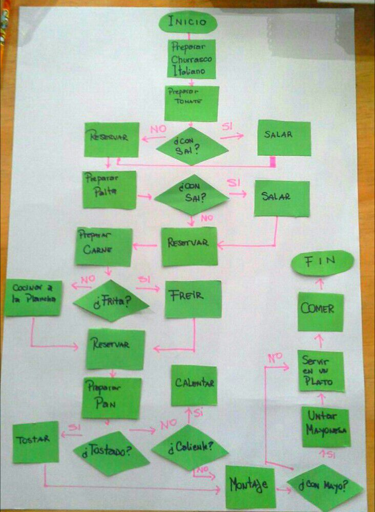

# Proyecto diagrama de preparacion churrasco

## Este proyecto tiene un diagrama de flujo sobre la preparacion de un churrasco italiano.
**Contexto:**

* Los ingredientes ya se encuentran a disposicion, y los materiales estan a la mano.

**Definiciones:**

* *reservar* : Guardar, en un plato para su uso posterior.
* *Montaje* : Corresponde al acoplamiento de los insumos ya procesados.

### Este proyecto hace:

* Mostrar diagrama de flujo de procedimientos.

 